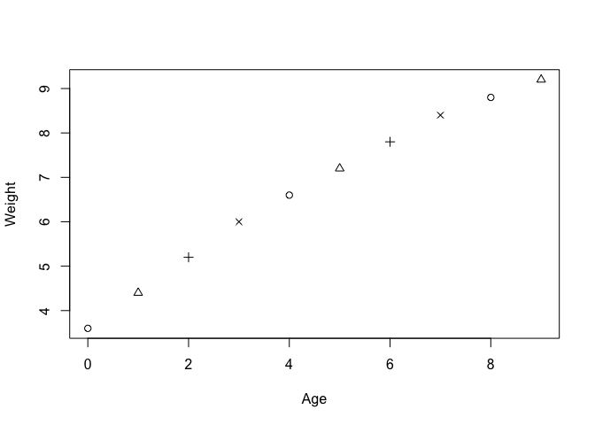
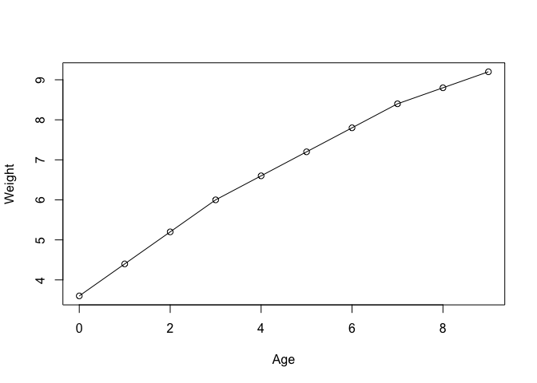
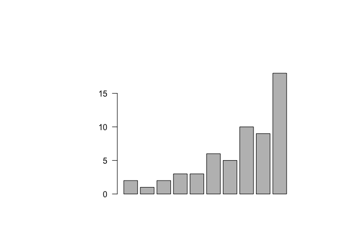
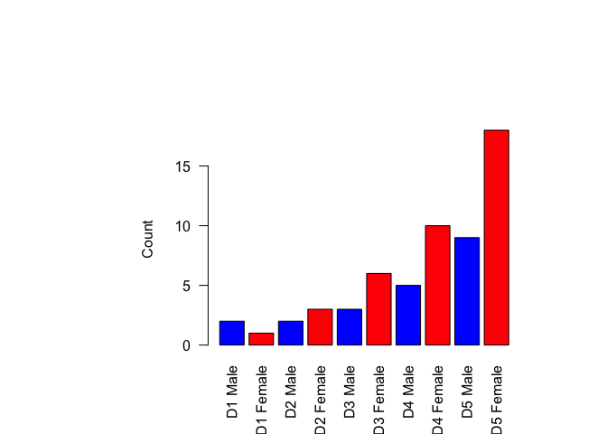
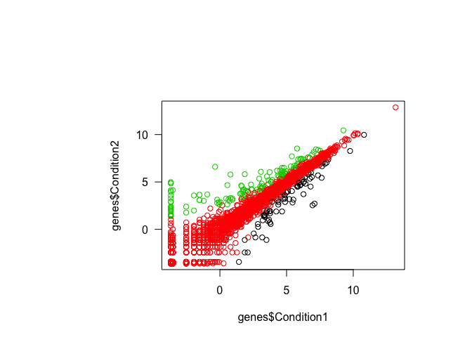

Class 05 winter 2019
================
Deepam Gupta
January 23, 2019

``` r
#class 5 graphics and plots with R
```

The hashtag sign with an appostrophe is the narative text that I can style bold and italic and add links to webpages. For bold we use a double star **bold** and for italic we just use a single star *itallic* andthe \[webpages\] (<https://rmarkdown.rstudio.com/articles_report_from_r_script.html>)

``` r
# section 2a: line plot
baby_weight <- read.table("bimm143_05_rstats/weight_chart.txt", header= TRUE)
class(baby_weight)
```

    ## [1] "data.frame"

``` r
plot(baby_weight, pch=15 ,type= "b",cex=1.5,lwd=2, ylim=c(2,10), xlab="Age (months", ylab="weight (kg)", main="Baby weight")
```


``` r
#if you need to have a series of different points, you can plot pch1:4 and then generate the series, for example
plot(baby_weight, pch=1:4)
```



``` r
#The overplot type will generate the lines which are not broken and are connected.
plot(baby_weight, type="o")
```



``` r
#section 2B Bar plot
#This gave us an error as the file data was separated by tab rather than spaces. So you can 
features <- read.table("bimm143_05_rstats/feature_counts.txt",sep="\t", header= TRUE)
#Plotting the barplot
barplot(features$Count, horiz=TRUE, xlab = "count", names.arg = features$Feature, main= "Count of different RNAs")
```


``` r
par(las=1)
par()$mar
```

    ## [1] 5.1 4.1 4.1 2.1

``` r
#The margin argument gives us the ability to change the margins. So,the vector that it takes is of the form, bottom, left top right.
par(mar=c(5,12,7.5,5))

par()$mar
```

    ## [1]  5.0 12.0  7.5  5.0

``` r
#Section 2C of the lab assignment
random <- c(rnorm(10000))
random <- c(rnorm(10000)+4)

hist(c((rnorm(10000)), rnorm(10000)+4, rnorm(10000)+6), breaks=10)
```


``` r
#Section 3A of the lab assignment
gender <- read.table("bimm143_05_rstats/male_female_counts.txt", header= TRUE, sep="\t")
#The other functions like read delim and all these functions do look like read table and have different variables.So, we can directly use read delim and it will save us some time. the read delim does the same thing but just calls the read table function with different variables. 
barplot(gender$Count)
```



``` r
color <- c("blue","red")
#what does the las argument do, so the las variable changes the way your axis are labelled. So, if you just use the default one, then because the name of the labels are big, they won't fit into the traditional system. Hence, we changed it into the 2 type, where we hope to get more perpendicular names
barplot(gender$Count, col=color, ylab="Count", names.arg = gender$Sample, las =2)
```



``` r
#Now, if we changed the content of the color vector to be just blue and red, we can see that it is alternating between them because we have used a 2 element vector. 
#Now we are installing the colorspace package
genes<- read.table("bimm143_05_rstats/up_down_expression.txt", header=TRUE, sep='\t')
nrow(genes)
```

    ## [1] 5196

``` r
#in order to have a summary of a particular column of the table, we can make use of the table function
table(genes$State)
```

    ## 
    ##       down unchanging         up 
    ##         72       4997        127

``` r
plot(genes$Condition1,genes$Condition2, col=genes$State)
```



``` r
#Now the above color scheme does not look right, I would want to have a scheme where unchanging is black, upregulated is red and down regulated is blue
palette()
```

    ## [1] "black"   "red"     "green3"  "blue"    "cyan"    "magenta" "yellow" 
    ## [8] "gray"

``` r
levels(genes$State)
```

    ## [1] "down"       "unchanging" "up"

``` r
palette()
```

    ## [1] "black"   "red"     "green3"  "blue"    "cyan"    "magenta" "yellow" 
    ## [8] "gray"

``` r
palette(c("blue","grey","red"))
#This is the color that I wanted. 
#Section
```
